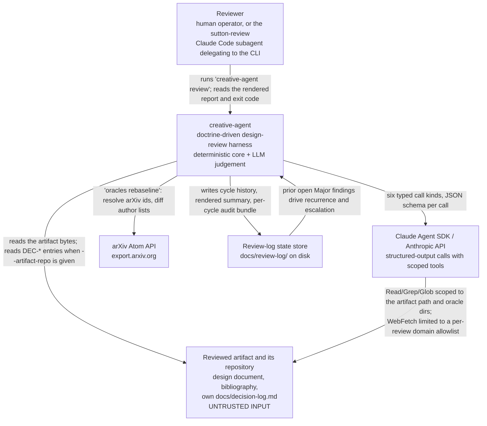
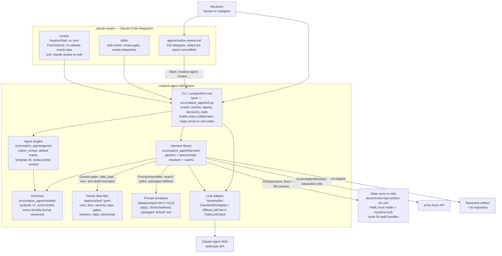
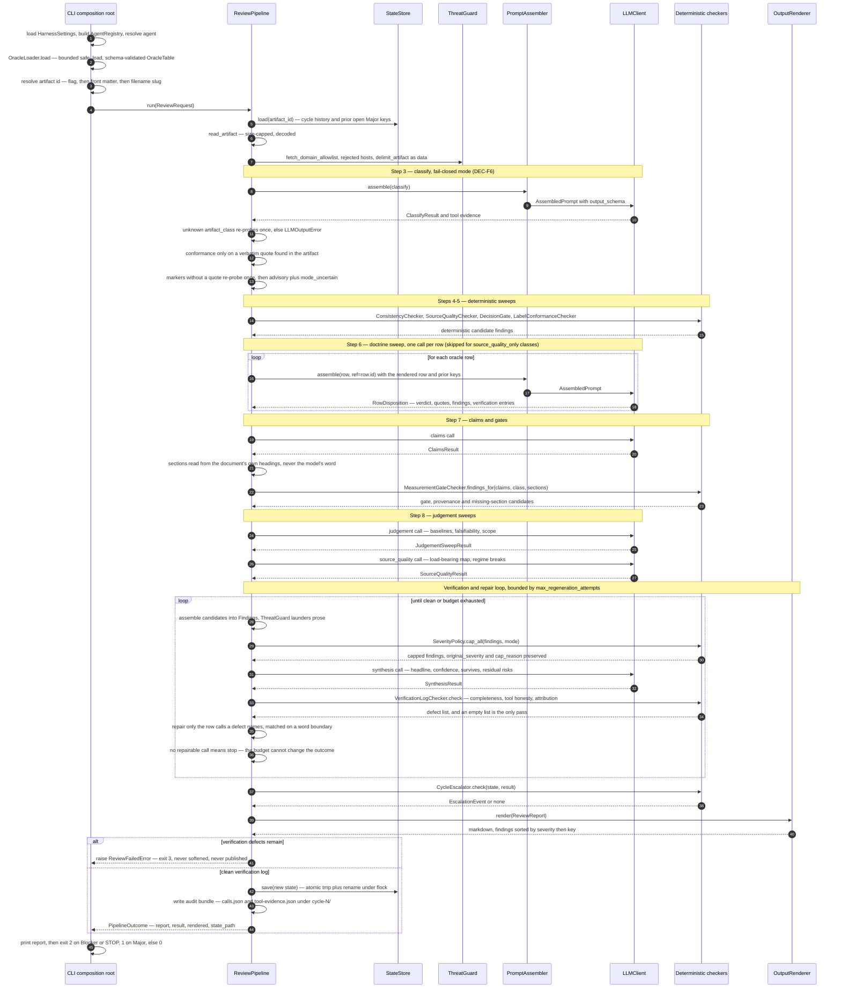
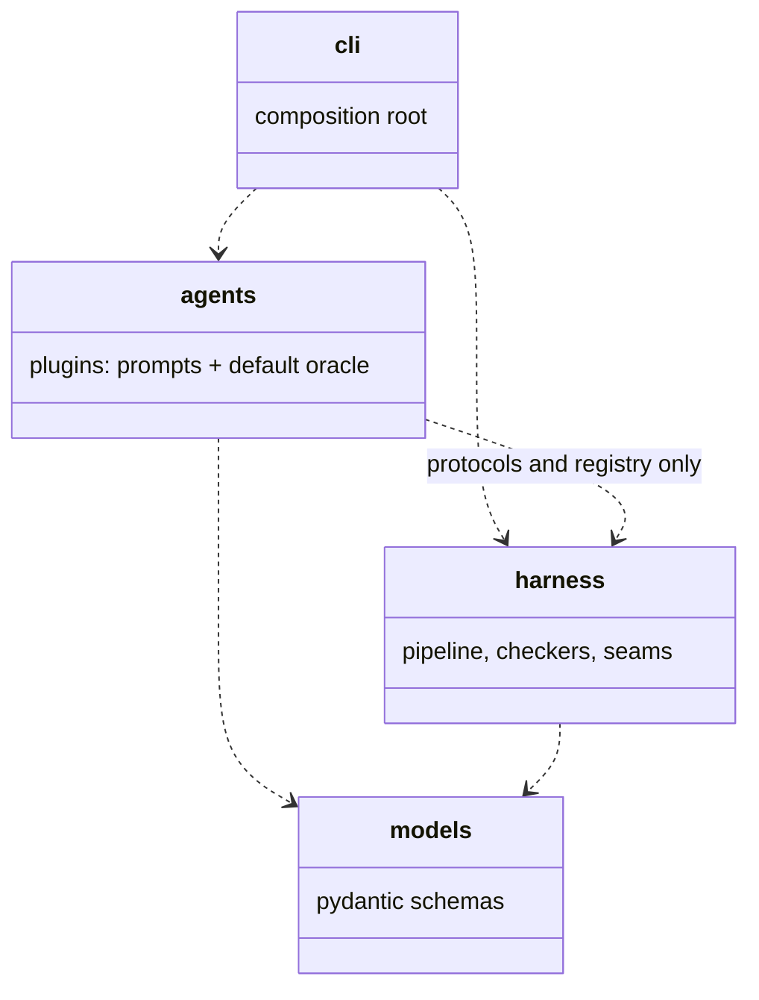
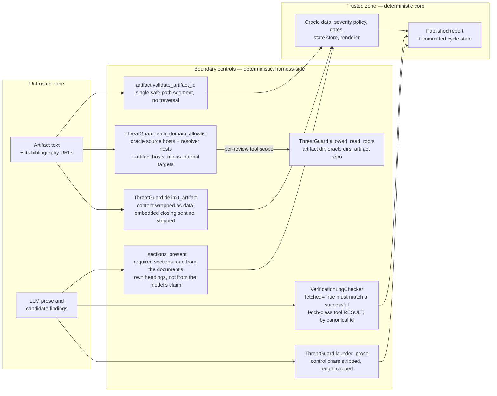

# Architecture — creative-agent

C4-model documentation for the `creative-agent` harness: an agent framework for
doctrine-driven review agents, shipping with `sutton-review`.

Related: [decision-log.md](decision-log.md) (framework decisions DEC-F1..F11),
[../README.md](../README.md), [../CLAUDE.md](../CLAUDE.md).

---

## 1. Purpose and context

`creative-agent` reviews a design document against a **review oracle** — a doctrine table
expressed entirely as data (`src/creative_agent/data/oracles/sutton.v2.yaml`). One run
classifies the artifact, sweeps it row by row against the doctrine, extracts and scores
measurement claims, checks source quality, assembles a findings table, and publishes a
markdown report plus durable per-artifact state under `docs/review-log/`.

The system is deliberately split in two halves:

- **A deterministic core.** Doctrine loading, severity capping, measurement-gate scoring,
  internal-consistency detection, verification-log completeness, tool honesty, decision
  gating, cycle escalation, state persistence, and the rendered output contract are plain
  Python over validated pydantic models. They are unit-testable, mutation-tested
  (`severity`, `gates`, `verification`, `consistency`), and golden-tested byte-for-byte.
- **LLM judgement only.** The Claude Agent SDK answers six typed, JSON-schema-constrained
  call kinds — `classify`, `row`, `claims`, `source_quality`, `judgement`, `synthesis`.
  It never emits the findings table, never sets the final severity of anything, and never
  writes the report.

The split exists because the failure modes differ. Structural rules must hold on every
run, including adversarial ones: a reviewer that can be talked out of a Blocker by the
document it is reviewing is worthless. Design judgement — is this baseline the simplest
one that plausibly matches, is this prediction above what a null model produces — has no
mechanical form. So each half does only what it can be held to: the model proposes
candidate findings with supports, and the harness decides what they are worth.

The corollary is the framework claim: **a new research corpus is a new YAML file, not new
code** (`tests/integration/test_cli_review.py::TestSecondOracleNeedsNoCode` proves it),
and `harness/` and `models/` are forbidden by an import-linter contract from importing
`agents/`.

---

## 2. C1 — System context



Exit codes are the machine-facing contract (`errors.ExitCode`): `0` clean or Info-only,
`1` findings at Major or above, `2` Blocker or charter-review STOP, `3` review failed
(incomplete verification log), `4` config/oracle error, `5` unexpected error.

---

## 3. C2 — Containers



Layering rule, enforced by `lint-imports`: **`harness/` and `models/` must never import
`agents/`.** The dependency runs one way — the CLI composition root is the only place
that knows both sides exist.

Override discipline is identical for oracles and prompts: earlier search-path entries win,
packaged data is the last fallback. Search paths, tool names, budgets, model ids, and
thresholds all come from `HarnessSettings` (env prefix `CREATIVE_AGENT_`, or a YAML file
named by `CREATIVE_AGENT_CONFIG`), never from a literal at a call site.

The `.claude/` assets are treated as executable configuration rather than documentation:
`harness/assets.py` is their schema — agent and skill front matter, hook executability,
settings shape — surfaced as `creative-agent assets validate` and re-run by the
`PostToolUse` hook (`.claude/hooks/validate-data.sh`) whenever an oracle file or a
`.claude` asset is edited, so a break surfaces at edit time rather than mid-review in
someone else's session. Like the oracle loader, it imports nothing from `agents/`.

---

## 4. C3 — Components of the harness

```mermaid
flowchart TB
    pipeline["ReviewPipeline<br/>harness/pipeline.py<br/>orchestrates the run; owns every structural decision"]

    subgraph det["Deterministic enforcement — no I/O, no clock, no model input"]
        severity["SeverityPolicy<br/>advisory cap, staleness cap, tier caps,<br/>multi-support blocker legitimacy"]
        gates["MeasurementGateChecker<br/>claims vs oracle gates,<br/>provenance, per-class sections"]
        sq["SourceQualityChecker<br/>cluster citations, bibliography<br/>hygiene, vendor domains"]
        consistency["ConsistencyChecker<br/>one symbol, two definitions"]
        verification["VerificationLogChecker<br/>completeness, tool honesty,<br/>attribution/impersonation"]
        oak["LabelConformanceChecker<br/>label invoked but an element<br/>never named"]
        decisions["DecisionGate<br/>required DEC-* in the artifact<br/>repo's own decision log"]
        guard["ThreatGuard<br/>fetch allowlist, read-root scoping,<br/>artifact delimiting, prose laundering"]
        escalator["CycleEscalator<br/>recurring open Major<br/>to charter-review STOP"]
    end

    subgraph seams["Injected seams — protocols in harness/protocols.py"]
        llmclient["LLMClient<br/>ClaudeSDKAdapter / OfflineLLMClient / FakeLLMClient"]
        statestore["StateStore<br/>FileStateStore"]
        clock["Clock<br/>SystemClock / FixedClock"]
        agentproto["ReviewAgent<br/>SuttonReviewAgent, via AgentRegistry"]
        citations["CitationResolver<br/>ArxivCitationResolver / NullCitationResolver<br/>used by 'oracles rebaseline', not by review"]
    end

    assembler["PromptAssembler<br/>jinja2 + schema from model_json_schema"]
    renderer["OutputRenderer<br/>the published markdown contract,<br/>sorted, LF-stable, golden-tested"]
    loader["OracleLoader<br/>YAML to validated OracleTable"]
    canonical["canonical<br/>arXiv id and DOI normalization"]
    artifactmod["artifact<br/>id resolution, size-capped read, sha256"]
    logging["logging<br/>get_logger, log_event, timed_stage"]

    pipeline --> severity
    pipeline --> gates
    pipeline --> sq
    pipeline --> consistency
    pipeline --> verification
    pipeline --> oak
    pipeline --> decisions
    pipeline --> guard
    pipeline --> escalator

    pipeline --> llmclient
    pipeline --> statestore
    pipeline --> clock
    pipeline --> agentproto

    pipeline --> assembler
    pipeline --> renderer
    pipeline --> artifactmod
    pipeline --> logging

    assembler -->|"AssembledPrompt: system, user, output_schema,<br/>allowed_tools, fetch allowlist"| llmclient
    agentproto -->|"prompt_template_dir, build_context"| assembler
    loader -->|"OracleTable configures every checker"| pipeline
    verification --> canonical
    sq --> canonical
    citations --> canonical
```



Notes on the shape:

- The pipeline receives `agent`, `oracle`, `llm`, `settings`, `state_store`, `clock` and
  constructs the checkers itself from oracle data. There are no module-level singletons.
- `SeverityPolicy`, `MeasurementGateChecker`, `SourceQualityChecker`, `ConsistencyChecker`
  and `LabelConformanceChecker` are pure functions over models — every threshold, gate
  name, severity, marker and pattern arrives from the `OracleTable`.
- Deterministic findings carry `origin="deterministic"` and are exempt from
  verification-log completeness: they are the harness's own mechanical checks and assert
  nothing on the model's behalf.
- `CitationResolver` is wired only by `creative-agent oracles rebaseline`; review-time
  citation resolution was cut deliberately, and unresolved rows are handled by the
  staleness severity cap instead.

---

## 5. Review pipeline — sequence of one run



Two ordering details worth keeping in mind: assembly and capping happen **inside** the
repair loop (each repair pass re-assembles from the current sweep state), and the report
is rendered before the failure branch, so a failed review still produced a complete,
inspectable document — it is simply not published and no state is written.

---

## 6. Key architectural decisions

Full text and rationale: [decision-log.md](decision-log.md). All ten are `CONFIRMED`.

| ID | Decision | One-line rationale |
|---|---|---|
| [DEC-F1](decision-log.md#dec-f1--agent-registry-style--confirmed) | Explicit in-process `AgentRegistry`, not entry-point discovery | A single distribution gains nothing from entry points and pays with editable-install staleness; migration later is one function. |
| [DEC-F2](decision-log.md#dec-f2--oracle-format--confirmed) | Doctrine tables are pydantic-validated YAML data files | All normative content lives in data, so a new corpus is a new file rather than new code; loaded with `safe_load` under size and depth bounds. |
| [DEC-F3](decision-log.md#dec-f3--severity-model--confirmed) | Ordered `Severity` enum; caps by `min()`, blocker legitimacy by multi-support | Caps must never raise severity, and the spec's word "alone" licenses a Blocker that a gate, safety or contradiction basis corroborates. |
| [DEC-F4](decision-log.md#dec-f4--state-format--confirmed) | State is markdown with machine-truth YAML front matter, written atomically | Cycle history has to be both human-readable and parseable; frozen old-version fixtures keep the format backwards-compatible forever. |
| [DEC-F5](decision-log.md#dec-f5--llm-structured-output--confirmed) | Native SDK structured output from `model_json_schema()`, not fenced JSON | Schema enforcement belongs in the transport; repair is per-call, bounded, and may only fix verification defects — never severities. |
| [DEC-F6](decision-log.md#dec-f6--conformance-mode-policy--confirmed) | Fail-closed conformance mode, requiring a quoted claim | Non-conformance with a program the author never joined is not a defect; markers without a quote re-probe once, then run advisory with an uncertainty flag. |
| [DEC-F7](decision-log.md#dec-f7--artifact-identity--confirmed) | Id resolution: flag, then front-matter `review-id`, then filename slug | Recurrence tracking needs a stable id across cycles; the content sha256 is a drift warning only, and builtin `hash()` is banned. |
| [DEC-F8](decision-log.md#dec-f8--determinism--coverage-policy--confirmed) | Injected `Clock`; branch coverage at 90% with per-package floors | Wall-clock reads are lint-banned so reviews are reproducible; the one coverage omit (`llm/claude_sdk.py`) is visible and requires this decision. |
| [DEC-F9](decision-log.md#dec-f9--threat-model--confirmed) | The reviewed artifact is untrusted: scoped tools, allowlisted fetch, laundered output | Prompt injection and SSRF are the realistic attacks on a reviewer, so tool scope is narrow and tool honesty is checked against results, not intentions. |
| [DEC-F10](decision-log.md#dec-f10--observability--confirmed) | Structured logging on the `creative_agent` namespace with stable event names | A wrong verdict must be traceable to the stage that decided it; prompts and artifact text are never logged, only sizes, ids, counts, durations. |
| [DEC-F11](decision-log.md#dec-f11--real-tool-scope-enforcement-via-pretooluse--confirmed) | A `PreToolUse` hook enforces DEC-F9's scoping at the SDK call boundary, not just in the prompt | The prior scoping was advisory for `WebFetch` and fully disconnected for `Read`/`Grep`/`Glob`; `can_use_tool` is dead code under this project's `permission_mode="dontAsk"`, so `PreToolUse` is the only mechanism that actually fires. |

---

## 7. Extension points

### Add an oracle — data only

1. Copy `src/creative_agent/data/oracles/sutton.v2.yaml`; change `oracle_id`, `name`,
   `version`, `description`. Place it in `./data/oracles/`, or point
   `CREATIVE_AGENT_ORACLE_SEARCH_PATHS` at one or more directories (`a,b`, `a:b`, or JSON
   list syntax). Packaged data is the last fallback.
2. Replace the corpus blocks — `rows` (ids matching `^[A-Z]\d+[a-z]?$`, tier, check,
   failure mode, sources with real identifiers; evidence-free rows set
   `disclosed_gap: true` and `tier: NONE`), `conformance.markers`,
   `severity_policy`, `gate_policy.gates`, `source_quality`, `artifact_classes`,
   `required_decisions` / `decision_traps`, `protocol`, and optionally
   `oak_conformance`, `attribution`, `decision_log_grammar`, `consistency`.
3. `creative-agent oracles validate <id>` — cross-references are validated too: unknown
   gate names in a class, duplicate row ids or class names, a decision trap with no
   required decision, an `oak_conformance.doctrine_ref` that is not a row, a
   `placeholder_row_id` that collides with the row grammar.
4. Run it: `creative-agent review <artifact> --oracle <id>`. No Python changes. If a
   corpus seems to need a code change, that is a missing field on `models/oracle.py`.

The `.claude/skills/add-oracle/` skill walks the same procedure, and the
`PostToolUse` hook re-validates on every edit under `data/oracles`.

### Add an agent — registry plus prompts

1. Implement the `ReviewAgent` protocol (`harness/protocols.py`): a `name` attribute,
   `default_oracle()`, `prompt_template_dir()`, and `build_context(request, oracle, state)`
   returning extra template variables. See `agents/sutton_review/agent.py` — 31 lines,
   because enforcement is not the agent's job.
2. Register it in `agents/__init__.py::build_registry()` via `AgentRegistry.register()`.
3. Ship templates under `data/prompts/<template_dir>/`: `system.md.j2` plus one per call
   kind (`classify`, `row`, `claims`, `source_quality`, `judgement`, `synthesis`). Any
   template you do not provide falls back to the packaged `default` directory. Templates
   render under `StrictUndefined`, so a missing context key fails loudly.
4. Select it with `--agent <name>` or `CREATIVE_AGENT_DEFAULT_AGENT`.

### Add an LLM backend — the `LLMClient` protocol

Implement one method:

```python
async def generate(self, prompt: AssembledPrompt) -> RawLLMResult: ...
```

`AssembledPrompt` carries `system`, `user`, `output_schema`, `allowed_tools` and
`fetch_domain_allowlist`; `RawLLMResult` carries `payload` (validated by the pipeline
against the call's model), `tool_evidence`, `model` and `cost_usd`. Three implementations
exist as reference: `ClaudeSDKAdapter` (the only module that touches the SDK),
`OfflineLLMClient` (schema-valid null judgement, so `--offline` still runs every
deterministic check), and `FakeLLMClient` (scripted by call kind, strict about unconsumed
scripts). Wire a new backend in `cli.py::review`, which is the composition root — the
pipeline only ever sees the protocol.

Any tool whose successful results should be able to back `fetched=True` must be named in
`CREATIVE_AGENT_FETCH_TOOL_NAMES`; `WebSearch` is deliberately excluded.

### Add a state store — the `StateStore` protocol

Implement `load(artifact_id) -> ReviewState` and `save(state, summary_markdown) -> Path`.
`FileStateStore` is the reference: markdown with `schema_version`'d YAML front matter,
`flock` around a tmp-file-plus-rename write, and a typed `StateCorruptError` with an
explicit `--reset-state` escape hatch instead of a silent cycle reset. A replacement must
preserve `open_major_keys()` semantics, since `CycleEscalator` depends on them, and is
substituted in `cli.py::review`.

### The layering contract



`pyproject.toml` declares the import-linter contract "harness must not import agents",
with `creative_agent.harness` and `creative_agent.models` as source modules and
`creative_agent.agents` forbidden. `uv run lint-imports` enforces it locally and in CI.
The practical consequence: no enforcement rule may ever be reachable only through a
plugin, and no plugin may weaken one.

---

## 8. Trust boundaries

**The reviewed artifact is untrusted input** (DEC-F9). It is a document written by someone
who wants a favourable review, read by a model with tools. Everything below sits on that
boundary.



Where each control sits:

- **ThreatGuard, artifact side.** Artifact content is wrapped in explicit
  `<<<ARTIFACT-UNDER-REVIEW ... END-ARTIFACT>>>` sentinels with any embedded closing
  sentinel escaped, and the system prompt states that the content is data, not
  instructions. The artifact id — which becomes a filename and a directory name — must be
  a single safe path segment whether it came from a flag or from the document's own front
  matter.
- **The fetch allowlist.** The SDK session may fetch only from hosts derived from oracle
  `SourceRef` URLs, the resolver hosts (`arxiv.org`, `doi.org`), and the artifact's own
  bibliography — never a hard-coded vendor list. Hosts harvested from the untrusted
  artifact are then filtered against the internal-host policy: loopback, private,
  link-local, reserved and multicast IP literals, cloud metadata addresses, configured
  internal suffixes, and single-label names. A rejected host is logged as
  `security.fetch_hosts_rejected` rather than silently dropped. Read/Grep/Glob are scoped
  to the artifact directory, the oracle directories, and the artifact repo. Permission
  mode comes from settings and is never `bypassPermissions`.
- **Output laundering.** Every LLM prose field that reaches the rendered report — finding
  summaries, dispositions, the headline, what-survives and residual-risks — passes through
  `launder_prose`: control characters removed, length capped at `max_prose_chars`. The
  renderer additionally escapes pipes and newlines for the markdown tables, and the model
  never emits the report itself.
- **The tool-honesty check.** This is the control that makes the verification log worth
  reading. `fetched=True` is verified against observed tool **results** with
  `is_error == False`, matched on canonicalized arXiv ids and DOIs so that `/abs` versus
  `/pdf`, version suffixes and redirects neither defeat nor fake-satisfy the check.
  `WebSearch` is excluded from the fetch-tool set by default: snippets support existence,
  never content and never absence. The companion attribution sweep rejects invented
  positions ("X would argue", "X believes") for any author named in the oracle's sources,
  matched diacritic-folded. Any defect the repair budget cannot clear raises
  `ReviewFailedError` and exit code 3 — the review refuses to publish rather than
  softening.
- **The model is never taken at its word on structure.** Required sections are read from
  the artifact's own headings; a model claim that a section exists is logged as
  `sections.claim_unsupported` and discarded. Unknown doctrine row references are dropped
  during assembly and, in `SeverityPolicy`, contribute no corroboration — so citing a
  non-existent row can never lift a severity cap.

What is deliberately outside the boundary: the oracle YAML files and prompt templates are
trusted configuration owned by the operator, and `docs/review-log/<id>.md` is trusted
state written only by this harness under a per-artifact lock, with single-writer semantics
assumed and documented.
