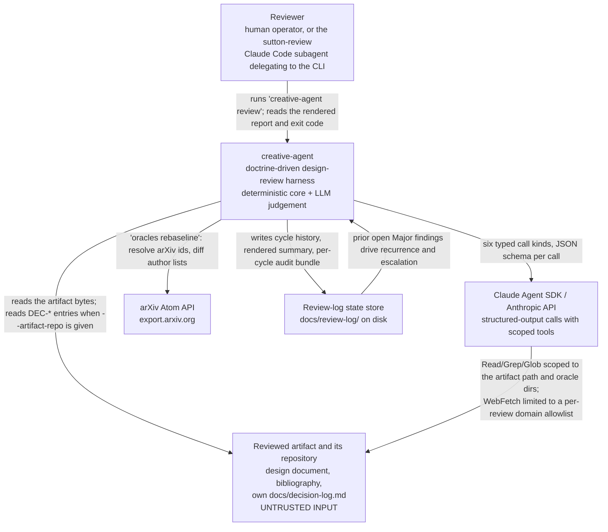
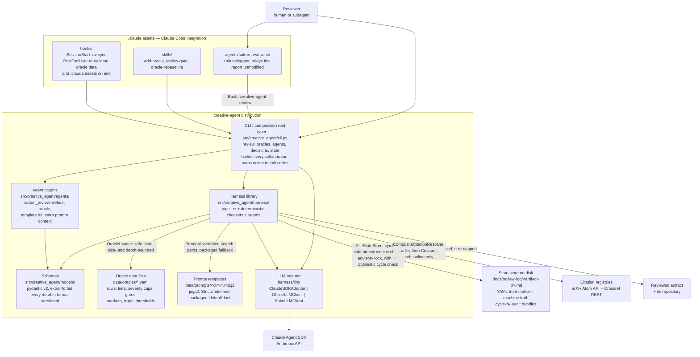
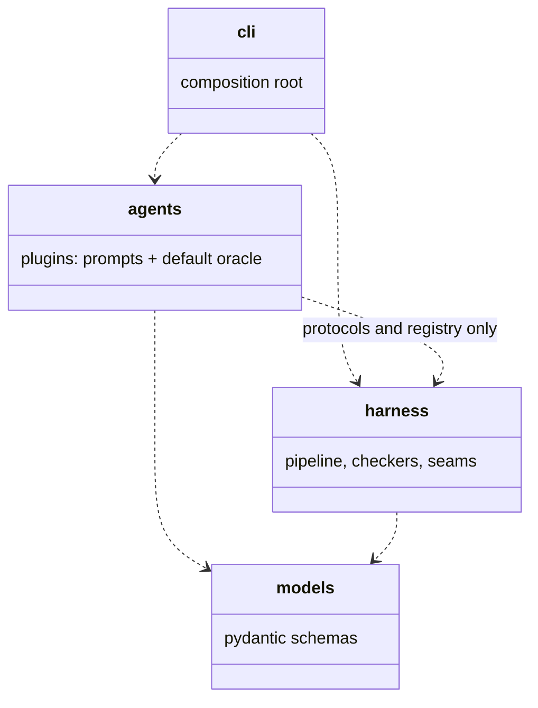
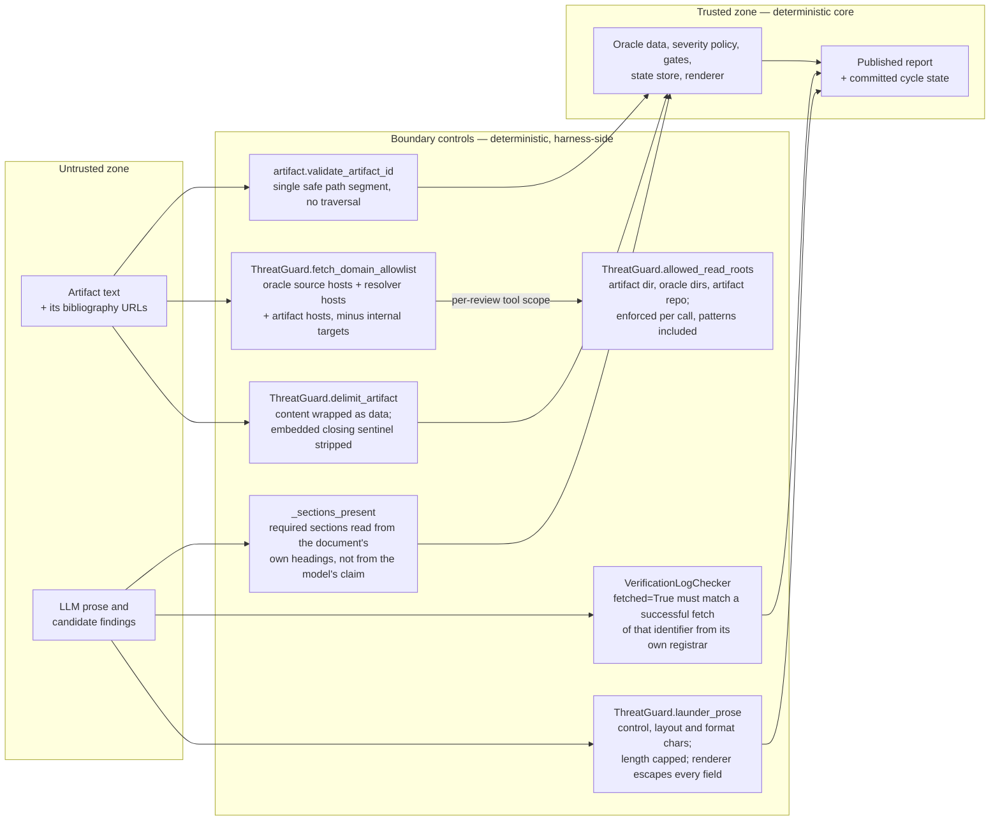

# Architecture — creative-agent

C4-model documentation for the `creative-agent` harness: an agent framework for
doctrine-driven review agents, shipping with `sutton-review`.

Related: [decision-log.md](decision-log.md) (framework decisions DEC-F1..F19),
[../README.md](../README.md), [../CLAUDE.md](../CLAUDE.md).

---

## 1. Purpose and context

`creative-agent` reviews a design document against a **review oracle** — a doctrine table
expressed entirely as data (`src/creative_agent/data/oracles/sutton.v2.yaml`). One run
classifies the artifact, sweeps it row by row against the doctrine, extracts and scores
measurement claims, checks source quality, assembles a findings table, and publishes a
markdown report plus durable per-artifact state under `docs/review-log/`.

The system is deliberately split in two halves:

- **A deterministic core.** Doctrine loading, severity capping, measurement-gate scoring,
  internal-consistency detection, verification-log completeness, tool honesty, decision
  gating, cycle escalation, state persistence, and the rendered output contract are plain
  Python over validated pydantic models. They are unit-testable, mutation-tested
  (`severity`, `gates`, `verification`, `consistency`), and golden-tested byte-for-byte.
- **LLM judgement only.** The Claude Agent SDK answers six typed, JSON-schema-constrained
  call kinds — `classify`, `row`, `claims`, `source_quality`, `judgement`, `synthesis`.
  It never emits the findings table, never sets the final severity of anything, and never
  writes the report.

The split exists because the failure modes differ. Structural rules must hold on every
run, including adversarial ones: a reviewer that can be talked out of a Blocker by the
document it is reviewing is worthless. Design judgement — is this baseline the simplest
one that plausibly matches, is this prediction above what a null model produces — has no
mechanical form. So each half does only what it can be held to: the model proposes
candidate findings with supports, and the harness decides what they are worth.

The corollary is the framework claim: **a new research corpus is a new YAML file, not new
code** (`tests/integration/test_cli_review.py::TestSecondOracleNeedsNoCode` proves it),
and `harness/` and `models/` are forbidden by an import-linter contract from importing
`agents/`.

---

## 2. C1 — System context



Exit codes are the machine-facing contract (`errors.ExitCode`): `0` clean or Info-only,
`1` findings at Major or above, `2` Blocker or charter-review STOP, `3` review failed
(incomplete verification log), `4` config/oracle error, `5` unexpected error, `6` run
aborted. `6` is deliberately distinct from `3`: `3` says the review ran and its verification
log could not be completed, which is a statement about the artifact, while `6` says the run
stopped before producing a verdict — budget exhaustion, a call timeout, or a concurrent
write to the same artifact's state — so nothing was published and a retry is meaningful
(DEC-F17). The table is frozen: an addition is deliberate, versioned and recorded here, in
`README.md`, in the decision log and in a tripwire test.

---

## 3. C2 — Containers



Layering rule, enforced by `lint-imports`: **`harness/` and `models/` must never import
`agents/`.** The dependency runs one way — the CLI composition root is the only place
that knows both sides exist.

Override discipline is identical for oracles and prompts: earlier search-path entries win,
packaged data is the last fallback. Search paths, tool names, budgets, model ids, and
thresholds all come from `HarnessSettings` (env prefix `CREATIVE_AGENT_`, or a YAML file
named by `CREATIVE_AGENT_CONFIG`), never from a literal at a call site.

The `.claude/` assets are treated as executable configuration rather than documentation:
`harness/assets.py` is their schema — agent and skill front matter, hook executability,
settings shape — surfaced as `creative-agent assets validate` and re-run by the
`PostToolUse` hook (`.claude/hooks/validate-data.sh`) whenever an oracle file or a
`.claude` asset is edited, so a break surfaces at edit time rather than mid-review in
someone else's session. Like the oracle loader, it imports nothing from `agents/`.

---

## 4. C3 — Components of the harness

```mermaid
flowchart TB
    pipeline["ReviewPipeline<br/>harness/pipeline.py<br/>orchestrates the run; owns every structural decision"]

    subgraph det["Deterministic enforcement — no I/O, no clock, no model input"]
        severity["SeverityPolicy<br/>advisory cap, staleness cap, tier caps,<br/>multi-support blocker legitimacy"]
        gates["MeasurementGateChecker<br/>claims vs oracle gates,<br/>provenance, per-class sections"]
        sq["SourceQualityChecker<br/>cluster citations, bibliography<br/>hygiene, vendor domains"]
        consistency["ConsistencyChecker<br/>one symbol, two definitions"]
        verification["VerificationLogChecker<br/>completeness, tool honesty,<br/>attribution/impersonation"]
        oak["LabelConformanceChecker<br/>label invoked but an element<br/>never named"]
        decisions["DecisionGate<br/>required DEC-* in the artifact<br/>repo's own decision log"]
        guard["ThreatGuard<br/>fetch allowlist, read-root scoping,<br/>artifact delimiting, prose laundering"]
        escalator["CycleEscalator<br/>recurring open Major<br/>to charter-review STOP"]
    end

    subgraph seams["Injected seams — protocols in harness/protocols.py"]
        llmclient["LLMClient<br/>ClaudeSDKAdapter / OfflineLLMClient / FakeLLMClient"]
        statestore["StateStore<br/>FileStateStore"]
        clock["Clock<br/>SystemClock / FixedClock"]
        agentproto["ReviewAgent<br/>SuttonReviewAgent, via AgentRegistry"]
        citations["CitationResolver<br/>Composite(Arxiv, Crossref) / NullCitationResolver<br/>used by 'oracles rebaseline', not by review"]
    end

    assembler["PromptAssembler<br/>jinja2 + schema from model_json_schema"]
    renderer["OutputRenderer<br/>the published markdown contract,<br/>sorted, LF-stable, golden-tested"]
    loader["OracleLoader<br/>YAML to validated OracleTable"]
    canonical["canonical<br/>arXiv id and DOI normalization,<br/>identifier authority binding"]
    artifactmod["artifact<br/>id resolution, size-capped read, sha256"]
    logging["logging<br/>get_logger, log_event, timed_stage"]
    filelock["filelock<br/>advisory lock + symlink-safe atomic write<br/>both platform backends bound at module scope"]
    migrations["migrations<br/>MigrationChain: ordered raw-dict upgrade steps<br/>between the version read and model_validate"]

    pipeline --> severity
    pipeline --> gates
    pipeline --> sq
    pipeline --> consistency
    pipeline --> verification
    pipeline --> oak
    pipeline --> decisions
    pipeline --> guard
    pipeline --> escalator

    pipeline --> llmclient
    pipeline --> statestore
    pipeline --> clock
    pipeline --> agentproto

    pipeline --> assembler
    pipeline --> renderer
    pipeline --> artifactmod
    pipeline --> logging

    assembler -->|"AssembledPrompt: system, user, output_schema,<br/>allowed_tools, fetch allowlist"| llmclient
    agentproto -->|"prompt_template_dir, build_context"| assembler
    loader -->|"OracleTable configures every checker"| pipeline
    verification --> canonical
    sq --> canonical
    citations --> canonical
    statestore --> filelock
    statestore --> migrations
    loader --> migrations
```



Notes on the shape:

- The pipeline receives `agent`, `oracle`, `llm`, `settings`, `state_store`, `clock` and
  constructs the checkers itself from oracle data. There are no module-level singletons.
- `SeverityPolicy`, `MeasurementGateChecker`, `SourceQualityChecker`, `ConsistencyChecker`
  and `LabelConformanceChecker` are pure functions over models — every threshold, gate
  name, severity, marker and pattern arrives from the `OracleTable`.
- Deterministic findings carry `origin="deterministic"` and are exempt from
  verification-log completeness: they are the harness's own mechanical checks and assert
  nothing on the model's behalf.
- `CitationResolver` is wired only by `creative-agent oracles rebaseline`; review-time
  citation resolution was cut deliberately, and unresolved rows are handled by the
  staleness severity cap instead — which, since DEC-F13, actually fires: a row with no
  verified source is stale from the first review, because the grace budget defaults to zero.
  `CompositeCitationResolver` tries arXiv first and Crossref second and reports `skipped`
  only when every backend skipped, so a source with no resolvable identifier says so rather
  than borrowing another backend's failure.
- `harness/filelock.py` and `harness/migrations.py` are shared infrastructure rather than
  enforcement. `filelock` holds the advisory lock and the symlink-safe atomic write that
  `FileStateStore` needs, and is the only module in `src/` allowed to import `fcntl` — both
  platform backends are bound at module scope so the non-POSIX branch is substitutable in a
  test rather than pragma'd past the coverage gate. `migrations` is the seam both durable
  read formats route through between the `schema_version` check and `model_validate`; its
  chain is empty today (v1 is current for both), so it is an identity pass whose plumbing is
  tested and the first real migration registers a step rather than inventing a mechanism
  (DEC-F18).

---

## 5. Review pipeline — sequence of one run

```mermaid
sequenceDiagram
    autonumber
    participant CLI as CLI composition root
    participant P as ReviewPipeline
    participant S as StateStore
    participant G as ThreatGuard
    participant A as PromptAssembler
    participant L as LLMClient
    participant D as Deterministic checkers
    participant R as OutputRenderer

    CLI->>CLI: load HarnessSettings, build AgentRegistry, resolve agent
    CLI->>CLI: OracleLoader.load — bounded safe_load, schema-validated OracleTable
    CLI->>CLI: resolve artifact id — flag, then front matter, then filename slug
    CLI->>P: run(ReviewRequest)

    P->>S: load(artifact_id) — cycle history and prior open Major keys
    P->>P: read_artifact — size-capped, decoded
    P->>G: fetch_domain_allowlist, rejected hosts, delimit_artifact as data

    Note over P,L: Step 3 — classify, fail-closed mode (DEC-F6)
    P->>A: assemble(classify)
    A->>L: AssembledPrompt with output_schema
    L-->>P: ClassifyResult and tool evidence
    P->>P: unknown artifact_class re-probes once, else LLMOutputError
    P->>P: conformance only on a verbatim quote found in the artifact
    P->>P: markers without a quote re-probe once, then advisory plus mode_uncertain

    Note over P,D: Steps 4-5 — deterministic sweeps
    P->>D: ConsistencyChecker, SourceQualityChecker, DecisionGate, LabelConformanceChecker
    D-->>P: deterministic candidate findings

    Note over P,L: Step 6 — doctrine sweep, one call per row (skipped for source_quality_only classes)
    loop for each oracle row
        P->>A: assemble(row, ref=row.id) with the rendered row and prior keys
        A->>L: AssembledPrompt
        L-->>P: RowDisposition — verdict, quotes, findings, verification entries
    end

    Note over P,D: Step 7 — claims and gates
    P->>L: claims call
    L-->>P: ClaimsResult
    P->>P: sections read from the document's own headings, never the model's word
    P->>D: MeasurementGateChecker.findings_for(claims, class, sections)
    D-->>P: gate, provenance and missing-section candidates

    Note over P,L: Step 8 — judgement sweeps
    P->>L: judgement call — baselines, falsifiability, scope
    L-->>P: JudgementSweepResult
    P->>L: source_quality call — load-bearing map, regime breaks
    L-->>P: SourceQualityResult

    Note over P,R: Verification and repair loop, bounded by max_regeneration_attempts
    loop until clean or budget exhausted
        P->>P: assemble candidates into Findings, ThreatGuard launders prose
        P->>D: SeverityPolicy.cap_all(findings, mode)
        D-->>P: capped findings, original_severity and cap_reason preserved
        P->>L: synthesis call — headline, confidence, survives, residual risks
        L-->>P: SynthesisResult
        P->>D: VerificationLogChecker.check — completeness, tool honesty, attribution
        D-->>P: defect list, and an empty list is the only pass
        P->>P: repair only the row calls a defect names, matched on a word boundary
        P->>P: no repairable call means stop — the budget cannot change the outcome
    end

    P->>D: CycleEscalator.check(state, result)
    D-->>P: EscalationEvent or none
    P->>R: render(ReviewReport)
    R-->>P: markdown, findings sorted by severity then key

    alt verification defects remain
        P-->>CLI: raise ReviewFailedError — exit 3, never softened, never published
    else clean verification log
        P->>S: save(new state, expected_cycle=the cycle this run loaded)
        S->>S: re-read the stored cycle under the write lock; mismatch raises StateConflictError
        P->>P: write audit bundle — calls.json and tool-evidence.json under cycle-N/
        P-->>CLI: PipelineOutcome — report, result, rendered, state_path
    end

    CLI->>CLI: print report, then exit 2 on Blocker or STOP, 1 on Major, else 0
```

Two ordering details worth keeping in mind: assembly and capping happen **inside** the
repair loop (each repair pass re-assembles from the current sweep state), and the report
is rendered before the failure branch, so a failed review still produced a complete,
inspectable document — it is simply not published and no state is written.

Two aborts can cut the run short before any of that. Accumulated LLM cost is checked inside
`_call`'s attempt loop, before each provider call, and each call runs under
`asyncio.timeout(llm_timeout_seconds)`; either raises a `RunAbortedError` and exits 6 with
nothing published. The state conflict at the end is the third, and it exists for the same
reason: by the time `save` is reached the verdict, the report and the rendered markdown are
all built from the snapshot loaded at the top, so a run whose history has moved underneath it
must abort rather than publish (DEC-F14, DEC-F17).

---

## 6. Key architectural decisions

Full text and rationale: [decision-log.md](decision-log.md). All nineteen are `CONFIRMED`.
F12 through F18 came out of a peer review that re-verified every claim the earlier entries
made against the code; four of them correct a control this document previously described as
holding when it did not, and F14 supersedes part of F4 while F15 and F16 extend F11 and F9.
F19 is what happened when that work was itself attacked: four of the new entries asserted
more than their code delivered, including a forged Blocker row that reached the published
report through the one table cell the renderer pass missed.

| ID | Decision | One-line rationale |
|---|---|---|
| [DEC-F1](decision-log.md#dec-f1--agent-registry-style--confirmed) | Explicit in-process `AgentRegistry`, not entry-point discovery | A single distribution gains nothing from entry points and pays with editable-install staleness; migration later is one function. |
| [DEC-F2](decision-log.md#dec-f2--oracle-format--confirmed) | Doctrine tables are pydantic-validated YAML data files | All normative content lives in data, so a new corpus is a new file rather than new code; loaded with `safe_load` under size and depth bounds. |
| [DEC-F3](decision-log.md#dec-f3--severity-model--confirmed) | Ordered `Severity` enum; caps by `min()`, blocker legitimacy by multi-support | Caps must never raise severity, and the spec's word "alone" licenses a Blocker that a gate, safety or contradiction basis corroborates. |
| [DEC-F4](decision-log.md#dec-f4--state-format--confirmed) | State is markdown with machine-truth YAML front matter, written atomically | Cycle history has to be both human-readable and parseable; frozen old-version fixtures keep the format backwards-compatible forever. |
| [DEC-F5](decision-log.md#dec-f5--llm-structured-output--confirmed) | Native SDK structured output from `model_json_schema()`, not fenced JSON | Schema enforcement belongs in the transport; repair is per-call, bounded, and may only fix verification defects — never severities. |
| [DEC-F6](decision-log.md#dec-f6--conformance-mode-policy--confirmed) | Fail-closed conformance mode, requiring a quoted claim | Non-conformance with a program the author never joined is not a defect; markers without a quote re-probe once, then run advisory with an uncertainty flag. |
| [DEC-F7](decision-log.md#dec-f7--artifact-identity--confirmed) | Id resolution: flag, then front-matter `review-id`, then filename slug | Recurrence tracking needs a stable id across cycles; the content sha256 is a drift warning only, and builtin `hash()` is banned. |
| [DEC-F8](decision-log.md#dec-f8--determinism--coverage-policy--confirmed) | Injected `Clock`; branch coverage at 90% with per-package floors | Wall-clock reads are lint-banned so reviews are reproducible; the one coverage omit (`llm/claude_sdk.py`) is visible and requires this decision. |
| [DEC-F9](decision-log.md#dec-f9--threat-model--confirmed) | The reviewed artifact is untrusted: scoped tools, allowlisted fetch, laundered output | Prompt injection and SSRF are the realistic attacks on a reviewer, so tool scope is narrow and tool honesty is checked against results, not intentions. |
| [DEC-F10](decision-log.md#dec-f10--observability--confirmed) | Structured logging on the `creative_agent` namespace with stable event names | A wrong verdict must be traceable to the stage that decided it; prompts and artifact text are never logged, only sizes, ids, counts, durations. |
| [DEC-F11](decision-log.md#dec-f11--real-tool-scope-enforcement-via-pretooluse--confirmed) | A `PreToolUse` hook enforces DEC-F9's scoping at the SDK call boundary, not just in the prompt | The prior scoping was advisory for `WebFetch` and fully disconnected for `Read`/`Grep`/`Glob`; `can_use_tool` is dead code under this project's `permission_mode="dontAsk"`, so `PreToolUse` is the only mechanism that actually fires. |
| [DEC-F12](decision-log.md#dec-f12--tool-honesty-evidence-must-be-authority-bound--confirmed) | An identifier counts as retrieved only from an http(s) fetch of its own registrar, and a `canonical_id` claim is matched by identifier, never by raw string | Canonicalizing the *requested target* made the check fake-satisfiable by a decoy URL or by a local `Read` of a file the artifact's author named; the defect was at the evidence boundary, not in extraction, so `canonicalize` is unchanged. |
| [DEC-F13](decision-log.md#dec-f13--an-unverified-doctrine-row-is-stale-from-the-start--confirmed) | The re-baseline grace budget defaults to zero, so an unverified row is stale immediately | The trigger was coupled to a counter that only rises when the operation that marks a source verified is run, so a freshly transcribed corpus — the state needing protection most — had none; fail-closed is the right default for a reviewer that refuses to soften. |
| [DEC-F14](decision-log.md#dec-f14--optimistic-concurrency-for-review-state--confirmed-supersedes-part-of-dec-f4) | `save` carries the expected prior cycle, re-reads under its own lock and raises `StateConflictError` | Detect and fail, do not serialise: holding a lock across a minutes-long review is a hang rather than an error, and by `save` the verdict is already computed from the stale snapshot, so retrying the write would publish it. |
| [DEC-F15](decision-log.md#dec-f15--deny-by-default-tool-scoping--confirmed-extends-dec-f11) | The `PreToolUse` hook matches every tool and denies by default; glob patterns are scoped like paths | A name-based matcher plus an allow-on-unknown fallback meant most tools were never inspected, and `Glob`'s pattern — the argument that decides where it searches — was never read at all. |
| [DEC-F16](decision-log.md#dec-f16--prose-laundering-covers-line-and-format-characters--confirmed-extends-dec-f9) | Laundering folds line and layout characters and removes Unicode format characters; the renderer escapes every model-supplied field | Stripping only C0/C1 let model prose open a second `**VERDICT**` line and forge a `## Findings` section, so the deterministic renderer's guarantee held only for callers that had already laundered correctly. |
| [DEC-F17](decision-log.md#dec-f17--run-level-budget-and-timeout-and-a-retryable-abort-code--confirmed) | Budget accumulates per run and every call runs under a timeout; both abort with the new `ExitCode.RUN_ABORTED = 6` | `max_budget_usd` was per call and `llm_timeout_seconds` was dead configuration; an abort is a statement about the run, and folding it into exit 3 would tell a CI consumer to read a transient stop as a finding about the document. |
| [DEC-F18](decision-log.md#dec-f18--migration-seams-for-the-two-durable-read-formats--confirmed) | One shared `MigrationChain` sits between the version read and `model_validate` in both durable loaders | Adding a seam retroactively is harder than leaving an empty one now; the report contract is excluded because nothing reads a report back, so what it needs is a documented consumer promise, which `README.md` carries. |
| [DEC-F19](decision-log.md#dec-f19--corrections-to-f12-f15-f16-and-f17-after-adversarial-review--confirmed) | Corrections to F12, F15, F16 and F17, recorded rather than edited into the originals | Four of those entries asserted more than their code delivered — an unescaped findings-table cell, unlaundered `scope_items`, a glob check that held only for a literal first segment, an opt-out honesty branch, an authority rule that both admitted a decoy and refused `doi.org/10.48550/arXiv.<id>`, and a budget bound roughly twice the setting. A log that overstates is worse than none; what was believed at the time is part of the record. |

---

## 7. Extension points

### Add an oracle — data only

1. Copy `src/creative_agent/data/oracles/sutton.v2.yaml`; change `oracle_id`, `name`,
   `version`, `description`. Place it in `./data/oracles/`, or point
   `CREATIVE_AGENT_ORACLE_SEARCH_PATHS` at one or more directories (`a,b`, `a:b`, or JSON
   list syntax). Packaged data is the last fallback.
2. Replace the corpus blocks — `rows` (ids matching `^[A-Z]\d+[a-z]?$`, tier, check,
   failure mode, sources with real identifiers; evidence-free rows set
   `disclosed_gap: true` and `tier: NONE`), `conformance.markers`,
   `severity_policy`, `gate_policy.gates`, `source_quality`, `artifact_classes`,
   `required_decisions` / `decision_traps`, `protocol`, and optionally
   `oak_conformance`, `attribution`, `decision_log_grammar`, `consistency`.
3. `creative-agent oracles validate <id>` — cross-references are validated too: unknown
   gate names in a class, duplicate row ids or class names, a decision trap with no
   required decision, an `oak_conformance.doctrine_ref` that is not a row, a
   `placeholder_row_id` that collides with the row grammar.
4. Run it: `creative-agent review <artifact> --oracle <id>`. No Python changes. If a
   corpus seems to need a code change, that is a missing field on `models/oracle.py`.

The `.claude/skills/add-oracle/` skill walks the same procedure, and the
`PostToolUse` hook re-validates on every edit under `data/oracles`.

### Add an agent — registry plus prompts

1. Implement the `ReviewAgent` protocol (`harness/protocols.py`): a `name` attribute,
   `default_oracle()`, `prompt_template_dir()`, and `build_context(request, oracle, state)`
   returning extra template variables. See `agents/sutton_review/agent.py` — 31 lines,
   because enforcement is not the agent's job.
2. Register it in `agents/__init__.py::build_registry()` via `AgentRegistry.register()`.
3. Ship templates under `data/prompts/<template_dir>/`: `system.md.j2` plus one per call
   kind (`classify`, `row`, `claims`, `source_quality`, `judgement`, `synthesis`). Any
   template you do not provide falls back to the packaged `default` directory. Templates
   render under `StrictUndefined`, so a missing context key fails loudly.
4. Select it with `--agent <name>` or `CREATIVE_AGENT_DEFAULT_AGENT`.

### Add an LLM backend — the `LLMClient` protocol

Implement one method:

```python
async def generate(self, prompt: AssembledPrompt) -> RawLLMResult: ...
```

`AssembledPrompt` carries `system`, `user`, `output_schema`, `allowed_tools` and
`fetch_domain_allowlist`; `RawLLMResult` carries `payload` (validated by the pipeline
against the call's model), `tool_evidence`, `model` and `cost_usd`. Three implementations
exist as reference: `ClaudeSDKAdapter` (the only module that touches the SDK),
`OfflineLLMClient` (schema-valid null judgement, so `--offline` still runs every
deterministic check), and `FakeLLMClient` (scripted by call kind, strict about unconsumed
scripts). Wire a new backend in `cli.py::review`, which is the composition root — the
pipeline only ever sees the protocol.

Any tool whose successful results should be able to back `fetched=True` must be named in
`CREATIVE_AGENT_FETCH_TOOL_NAMES`; `WebSearch` is deliberately excluded.

### Add a state store — the `StateStore` protocol

Implement `load(artifact_id) -> ReviewState` and
`save(state, summary_markdown, *, expected_cycle=None) -> Path`. `FileStateStore` is the
reference: markdown with `schema_version`'d YAML front matter read through the migration
chain, a symlink-safe tmp-file-plus-rename write fsynced under an advisory lock, and a typed
`StateCorruptError` with an explicit `--reset-state` escape hatch instead of a silent cycle
reset. A replacement must preserve `open_major_keys()` semantics, since `CycleEscalator`
depends on them, and is substituted in `cli.py::review`.

`expected_cycle` is the cycle the caller loaded. It is a keyword with a `None` default, so a
store that cannot detect conflicts stays substitutable — but the pipeline always passes it,
and an implementation that accepts it must re-read under the same lock that guards the write
and raise `StateConflictError` on a mismatch (DEC-F14). A store that silently ignores it is
a store that can lose an escalation.

### The layering contract



`pyproject.toml` declares the import-linter contract "harness must not import agents",
with `creative_agent.harness` and `creative_agent.models` as source modules and
`creative_agent.agents` forbidden. `uv run lint-imports` enforces it locally and in CI.
The practical consequence: no enforcement rule may ever be reachable only through a
plugin, and no plugin may weaken one.

---

## 8. Trust boundaries

**The reviewed artifact is untrusted input** (DEC-F9). It is a document written by someone
who wants a favourable review, read by a model with tools. Everything below sits on that
boundary.



Where each control sits:

- **ThreatGuard, artifact side.** Artifact content is wrapped in explicit
  `<<<ARTIFACT-UNDER-REVIEW ... END-ARTIFACT>>>` sentinels with any embedded closing
  sentinel escaped, and the system prompt states that the content is data, not
  instructions. The artifact id — which becomes a filename and a directory name — must be
  a single safe path segment whether it came from a flag or from the document's own front
  matter.
- **The fetch allowlist.** The SDK session may fetch only from hosts derived from oracle
  `SourceRef` URLs, the resolver hosts (`arxiv.org`, `doi.org`), and the artifact's own
  bibliography — never a hard-coded vendor list. Hosts harvested from the untrusted
  artifact are then filtered against the internal-host policy: loopback, private,
  link-local, reserved and multicast IP literals, cloud metadata addresses, the RFC 6598
  carrier-grade NAT range at 100.64.0.0/10, configured internal suffixes, and single-label
  names. Non-canonical IPv4 literals are covered too: `ipaddress` accepts only dotted quads,
  so `127.1`, `127.0.1`, `0x7f.0.0.1` and `0177.0.0.1` were all classified as public while
  any real fetcher expands them to loopback. Hosts now normalise through `socket.inet_aton`,
  the parser those callers use, and `not is_global` is checked alongside the explicit
  categories — neither predicate is sufficient alone, since IPv4 multicast is `is_global`.
  `is_fetch_allowed` also checks the **scheme**: host membership said nothing about how a URL
  would be dereferenced, so `file://arxiv.org/etc/passwd` passed on every review, needing no
  cooperation from the artifact because the resolver hosts are on every allowlist
  unconditionally. Only `http` and `https` are fetchable. A rejected host is logged as
  `security.fetch_hosts_rejected` rather than silently dropped. Permission mode comes from
  settings and is never `bypassPermissions`.
- **Read scoping, deny-by-default.** The `PreToolUse` hook matches **every** tool, not a named
  set, and allows a call only when it is explicitly scoped or the tool is listed in
  `HarnessSettings.unscoped_tools`; an unrecognised tool is denied and logged. `Read`, `Grep`
  and `Glob` are checked against the computed read roots — the artifact directory, the oracle
  directories, and the artifact repo when `--artifact-repo` is given — **including their
  path-shaped glob arguments**. `Glob` takes a required `pattern` and an optional `path`, so
  the pattern is what decides where a search starts; scoping takes its longest leading literal
  segment, joins it to the call's base directory, resolves it and applies the same containment
  predicate, which denies `/etc/**/*` and `../../**/*` while allowing a plain `*.md`. The
  trailing separator is kept when the partial final segment is trimmed, so an absolute pattern
  stays absolute: dropping it turned `/etc*/*` into an empty prefix, which reads as "relative
  to the base directory" and was therefore allowed — a one-character change from the pattern
  the original tests used walked past the whole check. Brace or bracket groups containing a
  path separator, and a leading `~`, are refused outright rather than guessed at, since both
  can expand to an absolute path from an empty literal prefix and no legitimate review needs
  either (DEC-F19). `Grep`'s `pattern` is a regex, not a path, and only its `glob` filters
  paths — scoping the regex would deny a legitimate search for a path-looking string inside the
  artifact — so per-tool argument shapes are data rather than an `in (...)` chain. A
  present-but-empty path key is a denial rather than a fallback to the working directory, and a
  relative path resolves against the tool call's own reported `cwd`, never this process's.
  `WebSearch` ships in `unscoped_tools` with its residual risk accepted: its query is
  unconstrained, so an artifact that can steer the model's search terms has an outbound
  channel, and issuance is logged with the query's *length* and never its text. A multi-tenant
  deployment must empty that list.
- **Output laundering.** Every LLM prose field that reaches the rendered report — finding
  summaries, dispositions, the headline, what-survives, residual-risks and scope-item
  references — passes through `launder_prose`: line breaks and tabs folded to a single space
  (folded before control characters are deleted, so `\v` and `\f` do not splice two words
  together), C0/C1 control characters removed, Unicode format characters removed (category
  `Cf`: zero-width spaces, bidi overrides and isolates, the BOM), whitespace runs collapsed,
  and length capped at `max_prose_chars`. Laundering is idempotent, which matters because prose
  passes through once per repair-loop iteration. The renderer does not rely on its caller
  having laundered correctly: it escapes every model-supplied field it emits — the verdict
  headline, the escalation message, the what-survives and residual-risk bullets, scope-item
  references and the model-supplied `row_id` — not only table cells, and escapes `\r` as well
  as `\n` because most markdown renderers break a line on a bare carriage return. The findings
  table's `doctrine_refs` and `gate_refs` are escaped too: `gate_refs` is copied verbatim from
  the model's `CandidateFinding` and is an unconstrained `list[str]`, so interpolated raw one
  entry closed the cell and opened a **forged Blocker row** in the published report — the exact
  defect this control exists to close, in the exact table it names, surviving the first fix
  that named it (DEC-F19). The model never emits the report itself. Structural fields the
  harness assigns, such as `finding_id`, are not model input and are deliberately left alone.
- **The tool-honesty check.** This is the control that makes the verification log worth
  reading, and it is **authority-bound**. `fetched=True` is verified against observed tool
  **results** with `is_error == False`; an identifier enters the observed-evidence set only
  from a successful fetch-class result whose target is an `http`/`https` URL *and* whose host
  is a registrar for one of the configured identifier schemes, matched on the host or a
  dot-anchored subdomain so `notarxiv.org` cannot pass as `arxiv.org` while `export.arxiv.org`
  does. The identifier is then read from the **host and path only** — a registrar returns 200
  for arbitrary query strings, so `arxiv.org/?x=arxiv.org/abs/<id>` is the model choosing a
  string rather than evidence of what was served, and requiring per-scheme agreement instead
  would refuse `doi.org/10.48550/arXiv.<id>`, arXiv's own DOI prefix and the standard modern
  citation form (DEC-F19). Authorities are configuration
  (`HarnessSettings.identifier_authority_hosts`), with one known limit recorded rather than
  half-fixed: that setting reaches this checker but not `ThreatGuard.fetch_domain_allowlist`,
  so a configured mirror is accepted as evidence while the `PreToolUse` hook still denies the
  fetch — "a mirror is a settings change" is not yet true end to end. Matching is then by what
  the entry *carries*, not by which field it fills: any entry whose `canonical_id` **or**
  `source_url` canonicalizes to a scholarly identifier is judged by identifier, and an evidence
  target that canonicalizes can never be credited as plain-string evidence. Branching on
  `canonical_id` alone made the control opt-out, since the model writes the entry and omitting
  the field restored the local-`Read` forgery verbatim (DEC-F19). Only an entry carrying no
  identifier at all is satisfied by an exact target match, which keeps a legitimate `Read` of
  the artifact under review working. This document previously said the opposite — that
  canonical matching meant URL noise "neither defeats nor fake-satisfies" the check.
  Canonicalization is a substring match over an arbitrary string, which is right for identity
  bucketing and wrong as proof of retrieval: it was exactly what made the check
  fake-satisfiable, by a decoy URL on any allowlisted host and by a local `Read` of a file
  whose name the artifact's own author controls (DEC-F12). The consequence for reviewers is
  deliberately strict: a DOI claim is creditable only from a `doi.org` fetch, not from the
  publisher page a DOI redirects to, and the failure direction is a refused review, never a
  published false claim. `WebSearch` is excluded from the fetch-tool set by default: snippets
  support existence, never content and never absence. The companion attribution sweep rejects
  invented positions ("X would argue", "X believes") for any author named in the oracle's
  sources, matched diacritic-folded. Any defect the repair budget cannot clear raises
  `ReviewFailedError` and exit code 3 — the review refuses to publish rather than softening.
- **The model is never taken at its word on structure.** Required sections are read from
  the artifact's own headings; a model claim that a section exists is logged as
  `sections.claim_unsupported` and discarded. Unknown doctrine row references are dropped
  during assembly and, in `SeverityPolicy`, contribute no corroboration — so citing a
  non-existent row can never lift a severity cap.
- **The artifact *path* is untrusted, not only its contents.** The documented
  `--artifact-repo` flow reviews a checked-out worktree and git carries symlinks, so the
  reviewed repository chooses where `docs/design.md` actually points, and Typer's
  `dir_okay=False` rejects directories and nothing else. `read_artifact` now refuses anything
  that is not a regular file — `stat().st_size` reports 0 for a character device, so a
  one-line symlink to `/dev/zero` passed the size cap and then read unbounded — and, when
  `--artifact-repo` is given, refuses a path the operator located *inside* that repository
  that resolves outside it. The containment check is deliberately conditional on where the
  operator pointed: naming a document that genuinely lives outside the repository while
  passing `--artifact-repo` so `DecisionGate` reads that repository's decision log is a
  legitimate pattern. Symlinks that stay inside the tree are fine; refusing every symlink
  would break ordinary checkouts to no benefit.
- **The state path is a write target, not just a trusted file.** The state temp file and the
  lock file are opened without following symlinks — the temp file is unlinked and re-created
  with `O_EXCL`, since `unlink` removes a symlink itself rather than its target, and the lock
  opens with `O_NOFOLLOW` — because a symlink planted at either path previously turned an
  atomic state write into an arbitrary-file overwrite with partly attacker-influenced
  content, plus a truncate primitive via the lock. Content is fsynced before `os.replace`, so
  "atomic" survives a crash and not only an interleaving; `os.replace` onto the final path
  was already safe.

What is deliberately outside the boundary: the oracle YAML files and prompt templates are
trusted configuration owned by the operator, and `docs/review-log/<id>.md` is trusted
state written only by this harness. Concurrency is no longer assumed away: a second review
of the same artifact is **detected and refused**, not merged and not serialised.
`FileStateStore.save` re-reads the stored cycle under the lock that guards the write and
raises `StateConflictError` (exit 6) when it no longer matches the cycle the caller loaded,
because by that point the verdict, the report and the rendered markdown are all built from a
snapshot that no longer describes the artifact's history — and the recurrence count that
drives the cycle-3 charter-review STOP is part of what was lost. The lock itself stays
advisory and single-host by design; correctness against a concurrent writer comes from that
cycle check, not from the lock (DEC-F14, superseding the part of DEC-F4 that said
single-writer was assumed and documented).

Two residual risks are documented and declined rather than fixed, both because closing them
needs a fetcher the harness does not own: a `WebFetch` redirect chain from an allowed host to
an internal one is invisible to a hook that sees only the initial URL, and an authority-bound
fetch is credited without inspecting the response body (DEC-F11, DEC-F12).
